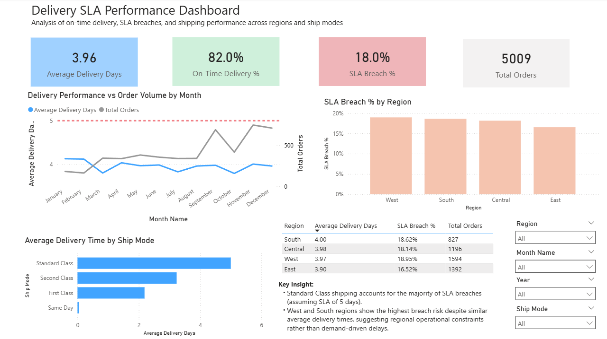
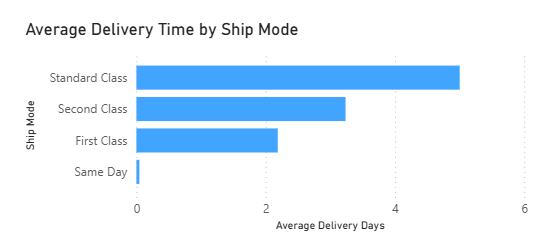
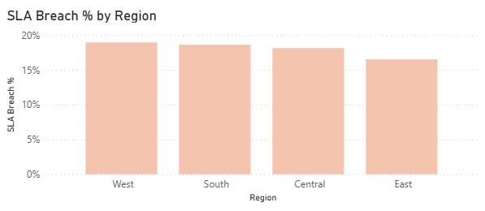
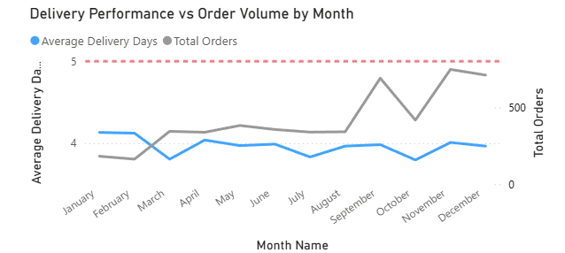
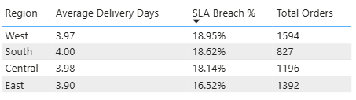

# Operations & Delivery Performance Dashboard (Power BI)

## Overview

This dashboard analyzes delivery performance and SLA adherence for a global e-commerce business using **Power BI**.
It provides insights into **average delivery times, SLA breaches, regional performance, and shipping mode effectiveness** to help operations teams make informed, data-driven decisions.p.

---

## Business Problem

A global e-commerce business ships orders across multiple regions using different shipping methods.
Leadership lacks clear visibility into:

- SLA compliance for delivered orders
- Shipping modes contributing most to delays
- Regions with operational inefficiencies
- Month-to-month delivery performance trends 

Without these insights, it becomes difficult to:

- Prioritize operational improvements
- Ensure timely delivery of orders
- Identify bottlenecks before peak demand periods
- Allocate resources effectively across regions  

---

## Dashboard Objectives

The dashboard is designed to help stakeholders:

- Monitor overall delivery performance
- Track On-Time Delivery % and SLA Breach %
- Identify shipping modes with highest delays
- Detect regional bottlenecks and operational risks
- Understand delivery trends across months  

---

## Key KPIs

| KPI | Description |
|----|------------|
| **Average Delivery Days** | Average time from order to delivery |
| **On-Time Delivery %** | Percentage of orders delivered within SLA (≤ 5 days) |
| **SLA Breach %** | Percentage of orders exceeding SLA ( > 5 days) |
| **Total Orders** | Total number of delivered orders |

---

## Key Visuals

### Dashboard Overview

---

### Average Delivery Days by Shipping Mode
- Identifies which shipping methods are closest to SLA limits
- Highlights Standard Class as the main contributor to delivery risk 

---

### SLA Breach % by Region
- Highlights regions with the highest SLA violations
- Helps prioritize operational improvements geographicallys  

---

### Delivery Performance vs Orders (Monthly)
- Shows relationship between total orders and average delivery days
- SLA reference line at 5 days provides clear benchmark 

---

### Regional Performance Summary
- Table shows Region, Average Delivery Days, SLA Breach %, and Total Orders
- Provides drill-down for operational teams 

---

## Key Insights

- **Standard Class** shipping accounts for the majority of SLA breaches
- **West and South regions** have the highest SLA breach rates
- Average delivery times are generally below SLA, but risk is concentrated in specific regions and shipping modes
- Delivery delays are **not strongly correlated with order volume**, indicating operational rather than demand-driven issues
- SLA breaches occur sporadically throughout the year, highlighting process gaps even outside peak months

---

## Business Recommendations

- Focus on improving **Standard Class shipping operations** to reduce SLA breaches
- Prioritize **West and South regions** for operational improvements
- Monitor SLA compliance closely during **early and mid-year months**
- Use monthly trends to plan staffing, warehouse allocation, and shipping strategies

---

## Tools & Technologies

- **Power BI**
- **DAX** (for Average Delivery Days, On-Time Delivery %, SLA Breach %)
- Star schema / Fact-Dim modeling
- **Public E-Commerce Dataset (Kaggle)**

---

## Dataset

- **Source:** Public E-Commerce dataset (Invoice-level transactional data)
- **Time Period:** Dec 2010 – Dec 2011  
- **Link:** [https://www.kaggle.com/datasets/carrie1/ecommerce-data  ](https://www.kaggle.com/datasets/carrie1/ecommerce-data)

---

## Notes

- SLA threshold is set at 5 days for analysis
- Dataset includes completed orders only
- Monthly trends include SLA reference line for easy benchmarking
- Visuals are designed to highlight actionable insights for operations teams

---

## Future Enhancements

- Drill-down by state/city for hyper-local analysis
- Include warehouse and logistics data to better explain regional performance
- Add dynamic SLA threshold selection for scenario analysis
- Incorporate forecasting and predictive analytics for operational planning
